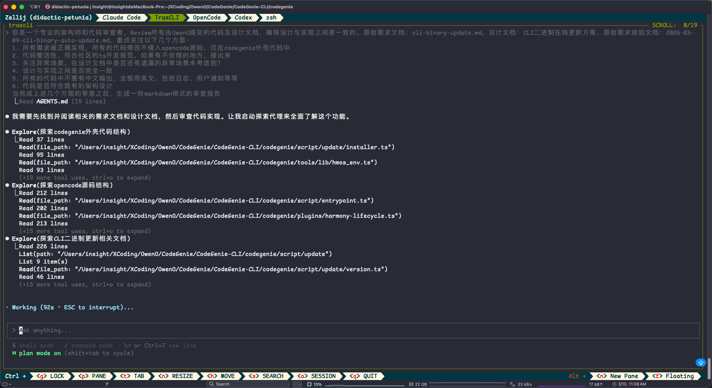

> **文档定位**: 本文档记录了使用 AI 工具开发 CLI 在线升级功能的完整实践过程，展示了多模型协作、迭代优化的高效开发模式，可作为 AI 辅助软件开发的优秀实践参考。
>
> **核心理念**: Claude 模型成本较高，用于核心的架构设计和编码工作；GLM-5 成本更低，用于审查、测试、文档校准等辅助工作——**高价值任务用高成本模型，辅助任务用低成本模型**，实现性价比最大化。
>
> **目标读者**: 对 AI 辅助开发感兴趣的开发者、希望提升开发效率的团队、需要了解多模型协作模式的实践者。
>
> **开发周期**: 2026-03-09 ~ 2026-03-10
>
> **涉及 AI 工具**: GLM-5 (Trae CLI)、Claude 4.6 Sonnet (Cursor)

---

## 目录

1. [背景与目标](#1-背景与目标)
2. [方案设计](#2-方案设计)
3. [代码审查](#3-代码审查)
4. [代码优化](#4-代码优化)
5. [单元测试](#5-单元测试)
6. [搭建本地 Docker 服务进行升级测试](#6-搭建本地-docker-服务进行升级测试)
7. [功能补齐](#7-功能补齐)
8. [问题修复](#8-问题修复)
9. [方案及代码审查](#9-方案及代码审查)
10. [实践总结与心得](#10-实践总结与心得)

---

## 1. 背景与目标

### 1.1 项目背景

CodeGenie CLI 是一个跨平台的命令行工具，需要实现二进制版本自动在线更新功能，支持用户无需手动下载即可升级到最新版本。该功能涉及版本检测、多平台支持、安全下载、原子安装、回滚机制等多个复杂模块。

### 1.2 核心需求

| 需求领域 | 具体要求 |
|---------|---------|
| 版本检测 | 远程获取最新版本、语义化版本比较、可配置检查频率 |
| 多平台支持 | macOS (x64/arm64)、Windows (x64)、Linux (x64/arm64) |
| 更新下载 | CDN下载、断点续传、进度显示、SHA256校验 |
| 更新安装 | 原子替换、权限处理、回滚机制 |
| 安全性 | HTTPS下载、签名验证、防中间人攻击 |

### 1.3 开发约束

- **非侵入原则**: `opencode/` 子模块零改动，仅修改外壳代码
- **遵循现有模式**: TypeScript + Bun API，无新增 npm 依赖
- **优雅降级**: 网络不可达时静默失败，不中断主功能

---

## 2. 方案设计

### 2.1 设计阶段 AI 协作模式

本阶段采用了**双模型协作**的设计模式，充分发挥不同模型的优势：

```
┌─────────────────────────────────────────────────────────────┐
│                    设计阶段 AI 协作流程                       │
├─────────────────────────────────────────────────────────────┤
│                                                             │
│   ┌──────────────┐    特性需求     ┌──────────────┐         │
│   │   GLM-5      │ ──────────────► │   Claude     │         │
│   │ (Trae CLI)   │                 │ 4.6 Sonnet   │         │
│   │              │                 │  (Cursor)    │         │
│   │ 擅长：需求    │                 │ 擅长：详细    │         │
│   │ 提炼、Prompt │ ◄────────────── │ 方案设计、    │         │
│   │ 工程         │    详细方案     │ 代码实现      │         │
│   └──────────────┘                 └──────────────┘         │
│                                                             │
└─────────────────────────────────────────────────────────────┘
```

### 2.2 第一步：使用 GLM-5 生成需求 Prompt

**操作说明**: 首先使用 GLM-5 将业务需求转化为结构化的技术需求文档，这一步的关键是让 AI 理解"我们要做什么"并输出给下一个 AI 使用。

**输入**: 业务背景和功能期望

**输出**: 结构化的特性需求文档 `cli-binary-update.md`

**核心内容**:
```markdown
## 需要完成的特性

### 1. 版本检测
- 支持从远程服务器获取最新版本信息
- 支持语义化版本比较（SemVer）
- 支持检查当前运行版本是否为最新
- 支持配置检查更新的频率（每次启动/每日/手动）

### 2. 多平台支持
- 支持 macOS (x64/arm64)
- 支持 Windows (x64)
- 支持 Linux (x64/arm64)
...
```

**实践心得**: GLM-5 在需求提炼方面表现出色，能够将模糊的业务需求转化为清晰的技术规格，为后续的详细设计奠定基础。

### 2.3 第二步：使用 Claude 4.6 Sonnet 进行详细设计

**操作说明**: 将 GLM-5 生成的需求文档输入给 Cursor 中的 Claude 4.6 Sonnet 模型，进行详细的方案设计。选择 Claude 的原因是其在代码架构设计和实现规划方面表现更优。

**输入**: `cli-binary-update.md` 需求文档

**输出**: 详细实现计划 `2026-03-09-cli-binary-auto-update.md`

**设计亮点**:

| 设计决策 | 说明 |
|---------|------|
| 模块化架构 | 将更新功能拆分为 8 个独立模块，职责清晰 |
| 非侵入实现 | 通过 entrypoint 命令拦截，零修改 opencode 源码 |
| 状态隔离 | 更新状态保存在独立目录 `~/.codegenie/update/` |
| 原子操作 | 使用 rename 实现原子替换，确保更新失败不影响现有版本 |

**模块结构设计**:
```
script/update/
├── index.ts        # 命令入口：解析子命令，分发给各处理函数
├── platform.ts     # 平台/架构检测 → artifact key
├── version.ts      # SemVer 解析与比较
├── manifest.ts     # 拉取并验证远端版本清单
├── state.ts        # 读写持久化状态
├── downloader.ts   # HTTP下载 + 进度显示 + SHA256校验 + 断点续传
├── installer.ts    # 备份 + 原子替换 + 验证 + 回滚
└── display.ts      # 终端输出工具
```

**截图记录**:


*Claude 4.6 Sonnet 生成的详细实现计划*


*任务分解与实施步骤*

### 2.4 设计阶段实践总结

| 阶段 | 使用工具 | 核心价值 |
|------|---------|---------|
| 需求提炼 | GLM-5 | 将业务需求转化为技术规格 |
| 详细设计 | Claude 4.6 Sonnet | 输出可执行的任务分解和代码框架 |

**关键发现**: 不同 AI 模型有不同的擅长领域，合理组合使用可以发挥各自优势。GLM-5 在需求理解和提炼方面表现优秀，而 Claude 在代码架构设计和实现规划方面更为出色。

---

## 3. 代码审查

### 3.1 审查策略

代码实现完成后，使用 GLM-5 对 Claude 生成的代码进行交叉审查。这种**"交叉审查"模式**能够有效发现 AI 生成代码中的潜在问题。

**审查流程**:
```
┌──────────────┐    设计文档     ┌──────────────┐    审查报告    ┌──────────────┐
│   Claude     │ ─────────────► │    GLM-5     │ ─────────────► │   Claude     │
│ 生成的代码   │                │   代码审查   │                │   优化代码   │
└──────────────┘                └──────────────┘                └──────────────┘
```

### 3.2 审查执行

**输入材料**:
- 详细设计文档 `update-server-design.md`
- Claude 生成的代码实现

**审查 Prompt**:
```
你是一个专业的代码审查者，请根据设计文档审查代码实现，重点关注：
1. 设计与实现之间的一致性
2. 代码整洁性，符合 TypeScript 开发规范
3. 异常场景处理是否完善
4. 安全性考虑是否到位
```

**输出**: 审查文档 `update-optimization-todo.md`

### 3.3 审查发现的问题

| 问题类型 | 具体问题 | 严重程度 |
|---------|---------|---------|
| 功能缺陷 | `--version` 降版功能无法正常工作 | 必须修复 |
| 代码规范 | 全局变量声明不一致 | 建议优化 |
| 安全隐患 | HTTPS URL 未强制校验 | 建议优化 |
| 功能缺失 | 版本解析不支持预发布标签 | 建议优化 |

**典型问题示例**:

```typescript
// 问题：--version 降版功能被 isNewer() 阻止
// 当前代码
if (!isNewer(targetVersion, currentVersion)) {
  log.ok(`Already on v${currentVersion}`)
  return  // 这里会阻止显式降级
}

// 修复方案
if (!targetVersionArg && !isNewer(targetVersion, currentVersion)) {
  // 只有自动更新模式才检查版本新旧
  log.ok(`Already on v${currentVersion}`)
  return
}
```

**截图记录**:


*GLM-5 生成的代码审查报告*

### 3.4 审查阶段实践总结

**关键发现**: AI 生成的代码虽然质量较高，但仍存在逻辑漏洞和边界情况处理不足的问题。通过另一个 AI 模型进行交叉审查，能够有效发现这些问题。

**最佳实践**:
- 使用设计文档作为审查基准，确保实现与设计一致
- 关注边界场景和异常处理
- 重视安全性检查

---

## 4. 代码优化

### 4.1 优化策略

基于 GLM-5 生成的审查报告，使用 Cursor 的 Claude 4.6 Sonnet 对代码进行优化。这一步的亮点是让 AI **"自我检查"** 自己生成的代码。

### 4.2 优化执行

**输入**: 审查报告 `update-optimization-todo.md`

**优化过程**:

```
Claude 4.6 Sonnet
      │
      │  输入：审查报告
      ▼
┌─────────────────────────────────────┐
│  1. 分析审查报告中的问题            │
│  2. 定位相关代码位置                │
│  3. 生成修复方案                    │
│  4. 应用修复                        │
│  5. 验证修复效果                    │
└─────────────────────────────────────┘
      │
      │  输出：优化后的代码
      ▼
```

**优化内容**:

| 优化项 | 修改内容 |
|-------|---------|
| 降版功能 | 修改版本检查逻辑，显式 `--version` 时允许降级 |
| 全局变量声明 | 统一在各文件顶部添加 `declare const` 声明 |
| HTTPS 校验 | 添加 URL 协议检查，仅允许 HTTPS（localhost 除外） |
| 预发布版本 | 扩展 SemVer 解析，支持 `v1.3.0-beta.1` 格式 |

**截图记录**:


*Claude 根据审查报告优化代码*

### 4.3 优化阶段实践总结

**关键发现**: AI 能够有效地根据审查报告进行代码优化，但需要明确的指导。审查报告的质量直接影响优化效果。

**最佳实践**:
- 审查报告应包含具体的代码位置和修复建议
- 优化后应进行验证测试
- 保持代码风格一致性

---

## 5. 单元测试

### 5.1 测试策略

单元测试是确保代码质量的重要环节。本阶段采用 AI 辅助生成测试用例，并通过 AI 审查测试覆盖率的模式。

### 5.2 测试覆盖分析

使用 GLM-5 读取需求、设计文档以及当前的单元测试信息，输出测试覆盖审查报告。

**审查报告内容** (`code-review-test-coverage.md`):

| 模块 | 测试文件 | 测试用例数 | 覆盖率评估 |
|------|---------|-----------|-----------|
| version.ts | version.test.ts | 19+ | ✅ 90%+ |
| state.ts | state.test.ts | 12+ | ✅ 95% |
| manifest.ts | manifest.test.ts | 5 | ⚠️ 50% |
| downloader.ts | downloader.test.ts | 6 | ⚠️ 20% |
| platform.ts | - | 0 | ❌ 0% |
| installer.ts | - | 0 | ❌ 0% |
| display.ts | - | 0 | ❌ 0% |
| index.ts | - | 0 | ❌ 0% |

**总体测试覆盖率**: 约 40%

### 5.3 测试用例补充

基于审查报告，使用 Cursor 的 Claude 补充测试用例：

**需要补充的测试模块**:

1. **platform.test.ts** - 平台检测测试
   - 各平台检测正确性
   - 不支持平台返回 null
   - binaryName 和 installPath 正确性

2. **installer.test.ts** - 安装回滚测试
   - 安装成功流程
   - 冒烟测试失败自动回滚
   - 备份元数据正确性

3. **补充 downloader.test.ts**
   - 断点续传（Range 请求）
   - SHA256 校验
   - 重试机制

### 5.4 测试阶段实践总结

**关键发现**: AI 生成的测试用例覆盖了主要功能，但边界场景和异常处理测试不足。需要专门的审查来发现测试盲点。

**最佳实践**:
- 先生成测试，再审查覆盖率
- 关注边界场景和异常处理
- 使用 mock 隔离外部依赖

---

## 6. 搭建本地 Docker 服务进行升级测试

### 6.1 测试环境搭建

为了进行端到端的升级测试，搭建了本地 Docker Mock 服务器，模拟真实的更新服务。

**测试架构**:
```
┌─────────────────────────────────────────────────────────────┐
│                      本地测试环境                            │
├─────────────────────────────────────────────────────────────┤
│                                                             │
│   ┌──────────────┐         ┌──────────────┐                │
│   │   Docker     │  HTTP   │   本地 CLI   │                │
│   │ Mock Server  │ ◄─────► │   实例       │                │
│   │              │         │              │                │
│   │ - manifest   │         │ - check-update│               │
│   │ - binaries   │         │ - update     │                │
│   └──────────────┘         │ - rollback   │                │
│                            └──────────────┘                │
│                                                             │
└─────────────────────────────────────────────────────────────┘
```

### 6.2 Mock 服务配置

**manifest.json 示例**:
```json
{
  "schemaVersion": 1,
  "channel": "stable",
  "latest": "99.0.0",
  "versions": {
    "99.0.0": {
      "releaseDate": "2026-03-09",
      "changelog": ["Test release for integration testing"],
      "artifacts": {
        "darwin-arm64": {
          "url": "http://localhost:3000/codegenie-darwin-arm64",
          "sha256": "<actual-sha256>",
          "size": 145098896
        }
      }
    }
  }
}
```

### 6.3 测试执行

**测试场景**:

| 场景 | 命令 | 预期结果 |
|------|------|---------|
| 检查更新 | `codegenie check-update` | 显示新版本可用 |
| 执行更新 | `codegenie update --yes` | 下载、校验、安装成功 |
| 回滚版本 | `codegenie rollback --yes` | 恢复到上一版本 |

**截图记录**:


*Docker Mock 服务启动*


*更新测试执行*


*测试结果验证*

### 6.4 测试阶段实践总结

**关键发现**: 本地 Mock 环境对于验证更新流程至关重要，能够快速迭代测试而无需依赖真实服务器。

**最佳实践**:
- 使用 Docker 隔离测试环境
- Mock 服务应支持 Range 请求（断点续传测试）
- 测试数据应覆盖各种边界场景

---

## 7. 功能补齐

### 7.1 静默升级方案对齐

在测试过程中，发现需要与 OpenCode 的静默升级方案对齐，并给出方案对比。

**方案对比**:

| 特性 | OpenCode 方案 | CodeGenie 方案 |
|------|--------------|---------------|
| 检查时机 | 启动时后台检查 | 启动时后台检查 |
| 通知方式 | 退出时通知 | 启动时通知 |
| 安装方式 | 手动确认 | 支持静默安装 |
| 配置项 | autoupdate: notify/true/false | 同左 |

**截图记录**:


*方案对比分析*

### 7.2 异常场景补齐

在功能补齐过程中，识别并补充了多个异常场景的处理：

**补充的异常场景**:

| 场景 | 处理方式 |
|------|---------|
| 网络中断 | 静默失败，下次重试 |
| SHA256 校验失败 | 删除临时文件，报错退出 |
| 安装失败 | 自动回滚到备份版本 |
| 磁盘空间不足 | 提前检查，友好提示 |
| 权限不足 | 提示使用管理员权限 |

**截图记录**:


*异常场景处理补充*

### 7.3 功能补齐阶段实践总结

**关键发现**: 功能开发是一个迭代过程，通过测试和对比分析能够发现遗漏的功能点。

**最佳实践**:
- 与类似项目对比，学习最佳实践
- 系统性梳理异常场景
- 用户友好的错误提示

---

## 8. 问题修复

### 8.1 问题定位（基于Cursor的多模态模型能力）

在测试过程中遇到了一个显示相关的问题，通过多模态 AI 辅助进行问题定位。

**问题描述**: 某些平台下更新功能异常

**定位过程**:
1. 收集错误日志和截图
2. 输入给 AI 进行分析
3. AI 识别问题根因
4. 生成修复方案

**截图记录**:


*错误日志分析*


*问题根因定位*

### 8.2 问题修复执行

**修复内容**:
- 平台检测逻辑修正
- 路径处理兼容性修复
- 权限设置跨平台适配

### 8.3 问题修复阶段实践总结

**关键发现**: 多模态问题需要系统性测试，AI 能够快速分析日志并定位问题根因。

**最佳实践**:
- 保留完整的错误日志和截图
- 系统性测试各平台
- AI 辅助加速问题定位

---

## 9. 方案及代码审查

### 9.1 最终审查

在代码上库前，使用 GLM-5 进行了全面的方案和代码审查。

**审查 Prompt（简洁版）**:
```
你是一个专业的架构师和代码审查者，Review所有提交的代码及设计文档，
确保设计与实现之间是一致的。重点关注以下几个方面：
1. 所有需求被正确实现，所有代码修改不侵入opencode源码
2. 代码整洁性，符合社区的ts开发规范
3. 关注异常场景，是否有遗漏
4. 设计与实现之间是否完全一致
5. 所有代码中不要有中文输出
6. 代码是否符合既有的架构设计
```

**截图记录**:


*GLM-5 执行最终审查*


*审查报告详情*

### 9.2 细节点审查

除了整体审查，还对细节点进行了专项审查，重点关注：

**审查内容**:
- 边界条件处理是否完善
- 错误提示信息是否友好
- 日志输出是否符合规范
- 代码注释是否清晰

**截图记录**:


*细节点审查*

### 9.3 提交前审查

最后上库前，让 GLM-5 做了一次代码和提交信息审查：

**审查内容**:
- Git 提交信息格式是否规范
- 变更文件清单是否完整
- 是否有遗漏的调试代码
- 是否有敏感信息泄露风险

**截图记录**:


*代码和提交信息审查*


*审查结果*

### 9.4 根据审查优化

让 Cursor 根据审查文档优化代码和提交信息：

**优化内容**:
- 修正提交信息格式，符合 Conventional Commits 规范
- 清理调试用的 console.log 语句
- 补充遗漏的错误处理分支

**截图记录**:


*根据审查结果优化*

### 9.5 细节点测试优化

**优化内容**:
- 补充边界场景的测试用例
- 优化测试用例的命名规范
- 增加异常路径的测试覆盖

**截图记录**:


*细节点测试优化*

### 9.6 单元测试最终审查

使用 GLM-5 读取需求、设计文档以及当前的单元测试信息，输出最终审查报告：

**审查维度**:
- 测试覆盖率是否达标（目标 ≥ 80%）
- 测试用例是否覆盖核心功能
- Mock 是否正确隔离外部依赖
- 断言是否充分验证预期行为

**截图记录**:


*单元测试最终审查*

### 9.7 基于审查报告修改

基于审查报告 `code-review-test-coverage.md`，使用 Cursor 进行最终修改：

**修改内容**:
- 补充 `platform.ts` 的单元测试
- 补充 `installer.ts` 的回滚场景测试
- 优化 `downloader.ts` 的断点续传测试

**截图记录**:


*基于审查报告的最终修改*

### 9.8 审查阶段实践总结

**关键发现**: 多轮审查能够发现不同层次的问题，从架构设计到代码细节，确保代码质量。

**最佳实践**:
- 上库前进行多轮审查
- 审查应覆盖需求、设计、实现、测试
- 根据审查结果迭代优化

---

## 10. 实践总结与心得

### 10.1 AI 辅助开发 Workflow 总结

本次开发实践形成了一套高效的 AI 辅助开发流程：

```
┌─────────────────────────────────────────────────────────────────────────┐
│                    AI 辅助开发 Workflow                                  │
├─────────────────────────────────────────────────────────────────────────┤
│                                                                         │
│  ┌─────────┐    ┌─────────┐    ┌─────────┐    ┌─────────┐             │
│  │ 需求    │───►│ 方案    │───►│ 代码    │───►│ 代码    │             │
│  │ 提炼    │    │ 设计    │    │ 实现    │    │ 审查    │             │
│  │ (GLM-5) │    │(Claude) │    │(Claude) │    │ (GLM-5) │             │
│  └─────────┘    └─────────┘    └─────────┘    └─────────┘             │
│       │              │              │              │                   │
│       │              │              │              │                   │
│       ▼              ▼              ▼              ▼                   │
│  ┌─────────────────────────────────────────────────────────────────┐  │
│  │                        迭代优化循环                              │  │
│  │  ┌─────────┐    ┌─────────┐    ┌─────────┐    ┌─────────┐      │  │
│  │  │ 代码    │───►│ 单元    │───►│ 集成    │───►│ 最终    │      │  │
│  │  │ 优化    │    │ 测试    │    │ 测试    │    │ 审查    │      │  │
│  │  │(Claude) │    │(Claude) │    │ (人工)  │    │ (GLM-5) │      │  │
│  │  └─────────┘    └─────────┘    └─────────┘    └─────────┘      │  │
│  └─────────────────────────────────────────────────────────────────┘  │
│                                                                         │
└─────────────────────────────────────────────────────────────────────────┘
```

### 10.2 多模型协作模式

| 阶段 | 推荐模型 | 原因 |
|------|---------|------|
| 需求提炼 | GLM-5 | 擅长理解业务需求，输出结构化文档 |
| 方案设计 | Claude 4.6 Sonnet | 擅长代码架构设计，输出可执行计划 |
| 代码实现 | Claude 4.6 Sonnet | 代码质量高，符合最佳实践 |
| 代码审查 | GLM-5 | 客观审查，发现问题 |
| 测试覆盖分析 | GLM-5 | 分析测试报告，输出优化建议 |

### 10.3 关键成功因素

1. **明确的需求文档**: AI 需要清晰的输入才能产生高质量的输出
2. **设计先行**: 详细的设计文档是代码审查的基准
3. **多轮迭代**: 通过审查-优化循环不断提升代码质量
4. **模型协作**: 不同模型各有所长，合理组合使用
5. **人工把关**: 关键决策和最终审查仍需人工参与

### 10.4 效率提升

> **说明**: 以下数据基于本次开发实践的经验估算，传统开发时间参考类似规模项目的历史数据，实际效果因项目复杂度和团队经验而异。

| 指标 | 传统开发 | AI 辅助开发 | 提升比例 |
|------|---------|------------|---------|
| 方案设计时间 | 4-8 小时 | 1-2 小时 | ~75% |
| 代码编写时间 | 8-16 小时 | 2-4 小时 | ~75% |
| 测试编写时间 | 4-8 小时 | 1-2 小时 | ~75% |
| 代码审查时间 | 2-4 小时 | 0.5-1 小时 | ~75% |

### 10.5 注意事项

1. **AI 生成代码需要审查**: AI 可能产生逻辑漏洞和安全问题
2. **保持代码风格一致**: 多次 AI 生成可能导致风格不一致
3. **测试覆盖要充分**: AI 生成的测试可能遗漏边界场景
4. **安全性要重视**: AI 可能忽略安全最佳实践

### 10.6 未来展望

- **更智能的模型协作**: 模型间自动协作，减少人工干预
- **实时代码审查**: 编码过程中实时审查和优化
- **自动化测试生成**: 根据代码自动生成完整测试套件
- **知识库积累**: 将项目知识沉淀，提升 AI 理解能力

---

## 11. 后续增强方向：构建可持续的 AI 辅助开发生态

基于本次实践，我们认识到高比例 AI 生成代码的项目需要更完善的规范和流程保障，以确保项目的长期可持续演进。以下是后续需要重点增强的方向。

### 11.1 利用 AI 编码工具的项目级配置

现代 AI 编码工具（如 Cursor、Trae CLI、Windsurf 等）提供了项目级配置能力，可以将团队规范"固化"到项目中，确保不同开发者、不同 AI 工具输出的一致性。

#### 11.1.1 Rules 规则文件

**作用**: 定义 AI 编码时必须遵循的规则，约束 AI 的输出风格和行为。

**典型配置** (`.cursorrules` 或 `.trae/rules.md`):

```markdown
# 项目编码规则

## 语言规范
- 使用 TypeScript，启用严格模式
- 所有函数必须有明确的类型签名
- 变量命名使用 camelCase，类型命名使用 PascalCase

## 代码风格
- 单个函数不超过 50 行
- 圈复杂度不超过 10
- 关键逻辑必须有注释说明

## 安全规范
- 禁止硬编码敏感信息
- 所有外部输入必须校验
- 使用 HTTPS 进行网络请求

## 项目约束
- 不修改 opencode/ 目录下的代码
- 新增功能需同步更新单元测试
- API 变更需更新相关文档
```

**实践效果**: 团队成员使用不同 AI 工具时，AI 会自动读取并遵循这些规则，大幅减少风格不一致的问题。

#### 11.1.2 Spec 规格文件

**作用**: 定义项目的功能规格、接口规格，作为 AI 理解项目上下文的基准。

**目录结构**:
```
spec/
├── features/           # 功能规格
│   ├── update.md       # 更新功能规格
│   └── rollback.md     # 回滚功能规格
├── api/                # API 规格
│   └── manifest.md     # Manifest 接口规格
└── constraints.md      # 项目约束汇总
```

**规格文件示例** (`spec/features/update.md`):

```markdown
# CLI 更新功能规格

## 功能概述
支持 CLI 工具在线检测并更新到最新版本。

## 接口定义
- `check-update`: 检查是否有新版本
- `update [--yes] [--version <v>]`: 执行更新
- `rollback [--yes]`: 回滚到上一版本

## 行为约束
- 网络不可达时静默失败
- 更新失败时自动回滚
- 支持断点续传

## 非功能需求
- 版本检测延迟 < 2s
- 下载支持进度显示
- SHA256 校验确保完整性
```

**实践效果**: AI 在编码时能够参考规格文件，确保实现与设计一致，减少需求理解偏差。

#### 11.1.3 Skill 技能文件

**作用**: 定义 AI 在特定场景下的技能和能力，让 AI "学会"项目特定的开发模式。

**技能定义示例** (`skill/code-review.md`):

```markdown
# 代码审查技能

## 触发场景
- PR 提交时
- 代码合并前

## 审查维度
1. **设计一致性**: 对照 spec/ 目录下的规格文件
2. **代码质量**: 检查复杂度、命名、注释
3. **测试覆盖**: 核心逻辑覆盖率 ≥ 80%
4. **安全性**: 检查敏感信息、输入校验

## 输出格式
### 审查报告
- Blocker: 必须修复的问题
- Major: 建议优化的问题
- Minor: 可选改进的问题
```

**技能定义示例** (`skill/test-generation.md`):

```markdown
# 测试生成技能

## 触发场景
- 新增功能代码时
- 修改核心逻辑时

## 生成策略
1. 分析代码的输入输出边界
2. 覆盖正常路径和异常路径
3. 使用 mock 隔离外部依赖
4. 测试用例命名清晰描述场景

## 覆盖率要求
- 核心业务逻辑: ≥ 90%
- 工具函数: ≥ 80%
```

**实践效果**: AI 能够根据场景自动应用相应技能，输出更符合项目标准的代码和测试。

#### 11.1.4 AGENTS.md 智能体定义

**作用**: 定义不同 AI 智能体的角色和职责，实现多智能体协作。

**智能体定义示例**:

```markdown
# 项目智能体定义

## 架构师智能体 (Architect)
- **职责**: 方案设计、架构评审
- **擅长**: 系统设计、模块划分、接口定义
- **输出**: 设计文档、架构图、技术决策

## 开发者智能体 (Developer)
- **职责**: 代码实现、功能开发
- **擅长**: TypeScript、Bun API、测试编写
- **输出**: 源代码、单元测试

## 审查者智能体 (Reviewer)
- **职责**: 代码审查、质量把关
- **擅长**: 发现问题、安全审计、性能分析
- **输出**: 审查报告、优化建议

## 协作流程
1. 架构师输出设计文档
2. 开发者根据设计实现代码
3. 审查者进行代码审查
4. 开发者根据审查意见优化
```

**实践效果**: 明确不同角色的职责边界，避免 AI 输出混乱，提升协作效率。

#### 11.1.5 配置文件整合示例

**项目根目录结构**:
```
project/
├── .cursorrules              # Cursor 规则
├── .trae/
│   └── rules.md              # Trae CLI 规则
├── spec/
│   ├── features/             # 功能规格
│   ├── api/                  # API 规格
│   └── constraints.md        # 约束汇总
├── skill/
│   ├── code-review.md        # 代码审查技能
│   ├── test-generation.md    # 测试生成技能
│   └── doc-update.md         # 文档更新技能
└── AGENTS.md                 # 智能体定义
```

### 11.2 标准化开发流程

基于项目级配置，建立标准化的 AI 辅助开发流程：

```
┌─────────────────────────────────────────────────────────────────────────┐
│                    标准化 AI 辅助开发流程                                 │
├─────────────────────────────────────────────────────────────────────────┤
│                                                                         │
│  阶段一：需求与设计                                                       │
│  ┌─────────┐    ┌─────────┐    ┌─────────┐                             │
│  │ 需求    │───►│ 设计    │───►│ 设计    │                             │
│  │ 提炼    │    │ 草案    │    │ 评审    │                             │
│  └─────────┘    └─────────┘    └─────────┘                             │
│  输出: spec/     输出: 设计草案   输出: spec/features/                   │
│                                                                         │
│  阶段二：实现与测试                                                       │
│  ┌─────────┐    ┌─────────┐    ┌─────────┐                             │
│  │ 代码    │───►│ 单元    │───►│ 代码    │                             │
│  │ 实现    │    │ 测试    │    │ 审查    │                             │
│  └─────────┘    └─────────┘    └─────────┘                             │
│  读取: rules     应用: skill/     应用: skill/                          │
│                  test-generation  code-review                           │
│                                                                         │
│  阶段三：集成与交付                                                       │
│  ┌─────────┐    ┌─────────┐    ┌─────────┐                             │
│  │ 集成    │───►│ 文档    │───►│ 代码    │                             │
│  │ 测试    │    │ 更新    │    │ 提交    │                             │
│  └─────────┘    └─────────┘    └─────────┘                             │
│                  应用: skill/                                           │
│                  doc-update                                             │
│                                                                         │
└─────────────────────────────────────────────────────────────────────────┘
```

**各阶段质量门禁**:

| 阶段 | 输入 | 输出 | 质量门禁 |
|------|------|------|---------|
| 需求提炼 | 业务需求 | spec/features/ | 需求评审通过 |
| 方案设计 | spec/features/ | 设计文档 | 设计评审通过 |
| 代码实现 | 设计文档 + rules | 源代码 | Lint + 类型检查通过 |
| 单元测试 | 源代码 + skill | 测试代码 | 覆盖率 ≥ 80% |
| 代码审查 | 源代码 + skill | 审查报告 | 无 Blocker 问题 |
| 文档更新 | 代码变更 | 更新文档 | 文档与代码一致 |

### 11.3 多人协作一致性保障

#### 11.3.1 工具差异统一

通过项目级配置文件，消除不同 AI 工具的输出差异：

| 配置文件 | 解决的问题 | 效果 |
|----------|-----------|------|
| rules | 代码风格不一致 | 所有工具遵循统一规则 |
| spec | 需求理解偏差 | 统一的功能规格基准 |
| skill | 输出质量参差 | 标准化的技能模板 |
| AGENTS.md | 角色职责混乱 | 明确的协作分工 |

#### 11.3.2 知识沉淀机制

**问题**: AI 辅助开发过程中的知识分散，难以复用。

**解决方案**:

| 知识类型 | 存储位置 | 更新时机 |
|----------|----------|----------|
| 编码规则 | rules 文件 | 规范变更时 |
| 功能规格 | spec/ 目录 | 需求变更时 |
| 开发技能 | skill/ 目录 | 流程优化时 |
| 架构决策 | docs/adr/ | 重大决策时 |

**ADR 模板** (Architecture Decision Records):

```markdown
# ADR-001: 使用 Bun 运行时

## 状态
已接受

## 背景
项目需要高性能的 TypeScript 运行时。

## 决策
采用 Bun 作为运行时，替代 Node.js。

## 后果
- 启动速度提升 3x
- 需要团队学习 Bun API
- 部分 npm 包可能不兼容
```

### 11.4 实施路线图

| 阶段 | 时间 | 任务 | 交付物 |
|------|------|------|--------|
| 短期 | 1-2 周 | 建立基础配置 | rules + spec 基础文件 |
| 中期 | 1-2 月 | 完善技能定义 | skill/ 完整目录 |
| 长期 | 3-6 月 | 持续优化 | 度量体系 + 自动化 |

### 11.5 度量指标

| 指标 | 计算方式 | 目标值 |
|------|---------|--------|
| AI 代码采纳率 | 采纳代码 / 生成代码 | ≥ 80% |
| 审查问题发现率 | AI 发现问题 / 总问题 | ≥ 70% |
| 测试覆盖率 | 覆盖行数 / 总行数 | ≥ 80% |
| 文档一致性 | 一致功能数 / 总功能数 | ≥ 95% |
| 开发效率提升 | (传统工时 - AI工时) / 传统工时 | ≥ 50% |

---

## 附录

### A. 相关文档索引

| 文档 | 说明 |
|------|------|
| `cli-binary-update.md` | 原始需求文档 |
| `2026-03-09-cli-binary-auto-update.md` | 详细实现计划 |
| `update-server-design.md` | 服务端设计规范 |
| `update-optimization-todo.md` | 代码优化清单 |
| `code-review-test-coverage.md` | 测试覆盖审查报告 |

### B. 命令行接口

```bash
# 检查是否有新版本（不执行安装）
codegenie check-update [--json]

# 更新到最新版本（默认交互确认）
codegenie update [--yes] [--version <semver>] [--silent]

# 回滚到上一个版本
codegenie rollback [--yes]
```

### C. 文件变更汇总

| 操作 | 文件 | 说明 |
|------|------|------|
| Create | `script/update/platform.ts` | 平台检测 |
| Create | `script/update/version.ts` | SemVer 比较 |
| Create | `script/update/state.ts` | 状态持久化 |
| Create | `script/update/manifest.ts` | 清单拉取与校验 |
| Create | `script/update/display.ts` | 终端输出工具 |
| Create | `script/update/downloader.ts` | 下载 + SHA256 + 断点续传 |
| Create | `script/update/installer.ts` | 原子安装 + 备份 + 回滚 |
| Create | `script/update/index.ts` | 命令调度入口 |
| Modify | `script/entrypoint.ts` | 命令拦截 + 后台检查 |
| Modify | `script/build.ts` | 注入 manifest URL 常量 |

---

*文档编写: 2026-03-10*
*实践者: OwenO*
*更新日期: 2026-03-13*
